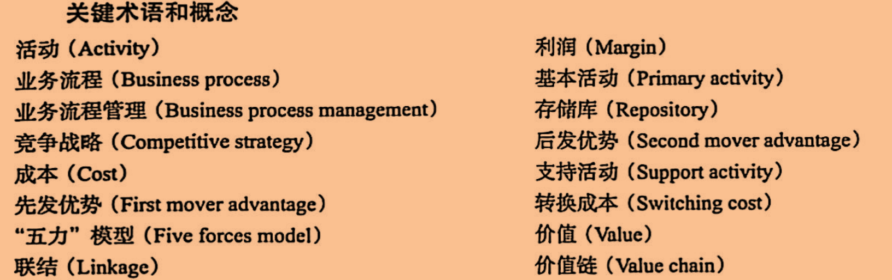

## 名称解释

产业结构决定竞争优势决定价值链决定业务流程决定信息系统，信息系统的存在是为了帮助企业实现战略

 **波特五力：**

- 购买者的议价能力
- 供应商的议价能力
- 替代品的威胁
- 同业竞争者的竞争程度
- 新进入者的威胁

**波特的四种竞争战略：**

- 成本战略
- 差异化战略
- 行业整体战略
- 专一化战略

**价值：**

客户愿意为一种资源、产品或者服务所支付的金额。

**价值链：**

一个关于价值创造活动的网络，由五项基本活动和四项支持活动组成。

- 基本活动：
  - 内部后勤
  - 生产制造
  - 外部后勤
  - 市场营销和销售
  - 顾客服务
- 支持活动：
  - 技术：研究和开发以及企业内部为开发新技术、新方法和新程序进行的其他活动
  - 。。。