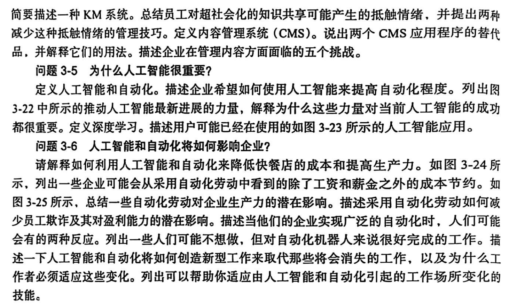
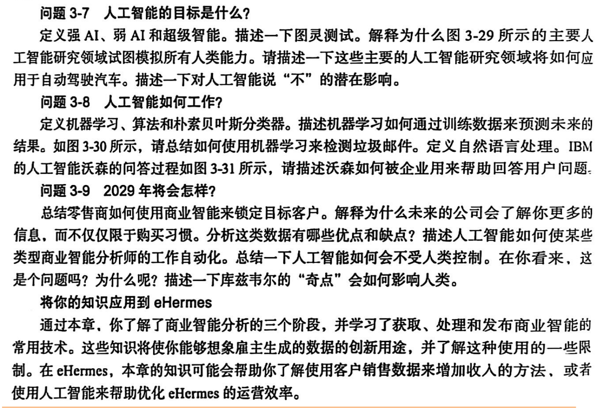
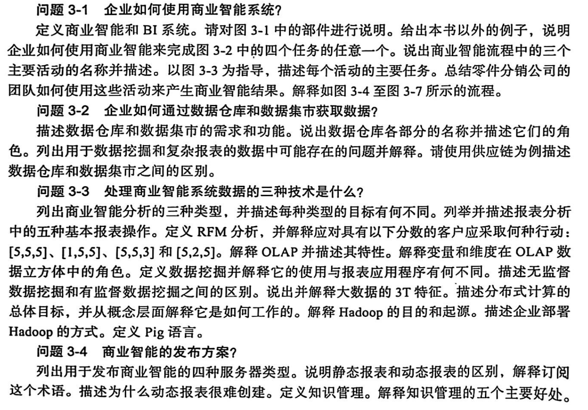

## 教材问题

## 1. 名词解释

以下是对这些名词的简单解释：

### 1.1. 算法（Algorithm）
算法是解决特定问题的一系列明确的、可执行的步骤，它能将输入数据转化为所需的输出结果。

### 1.2. 人工智能（Artificial Intelligence, AI）
人工智能是使计算机系统能够执行通常需要人类智能才能完成的任务的技术，如学习、推理、解决问题等。

### 1.3. 自动化（Automation）
自动化指利用技术手段使过程、任务或系统在无需人工干预的情况下自动运行。

### 1.4. 商业智能分析（BI analysis）
商业智能分析是对企业数据进行收集、整理、分析，以帮助企业做出更明智决策的过程。

### 1.5. 商业智能应用（BI application）
商业智能应用是基于商业智能技术开发的软件或工具，用于辅助企业进行数据分析和决策。

### 1.6. 大数据（Big Data）
大数据指规模巨大、类型多样、产生速度快的数据集合，需要特定技术和分析方法来处理。

### 1.7. 商业智能服务器（BI server）
商业智能服务器是提供商业智能服务的核心设备，负责存储、管理和处理企业的商业数据。

### 1.8. 商业智能（Business intelligence, BI）
商业智能是一种利用数据和分析来支持企业决策制定、提高业务绩效的技术和实践。

### 1.9. 商业智能系统（Business intelligence system）
商业智能系统是集成了数据采集、存储、分析和展示等功能的系统，为企业提供决策支持。

### 1.10. 聚类分析（Cluster analysis）
聚类分析是将数据对象分组为相似对象类别的过程，以便发现数据中的自然分组结构。

### 1.11. 内容管理系统（Content Management System, CMS）
内容管理系统是用于创建、管理和发布数字内容的软件平台。

### 1.12. 存储在用户本地终端的cookie（Cookies (in the user’s local knowledge)）
Cookie是网站存储在用户本地终端的小文件，用于记录用户的浏览信息和偏好。

### 1.13. 知识块（Data chunks）
知识块是将知识或数据按照一定规则划分成的相对独立的单元。

### 1.14. 数据获取（Data acquisition）
数据获取是从各种数据源收集数据的过程。

### 1.15. 数据集（Data sets）
数据集是一组相关数据的集合，通常用于数据分析和建模。

### 1.16. 数据挖掘（Data mining）
数据挖掘是从大量数据中发现潜在模式、关系和知识的过程。

应用统计技术来发现数据之间的模式和关系，以进行分类和预测。是人工智能和机器学习的学科融合结果。

### 1.17. 数据仓库（Data warehouses）
数据仓库是一个集成的、面向主题的、非易失的、随时间变化的数据集合，用于支持企业决策。

### 1.18. 决策支持系统（Decision support systems）
决策支持系统是辅助决策者利用数据和模型来解决半结构化或非结构化问题的信息系统。

### 1.19. 深度学习（Deep learning）
深度学习是机器学习的一个分支，使用多层神经网络来学习数据中的复杂模式和特征。

### 1.20. 维度（Dimension）
维度是数据的一个属性或特征，用于对数据进行分类和分析。

### 1.21. 下钻（Drill down）
下钻是在数据分析中，从汇总数据深入到详细数据的过程。

### 1.22. 动态报表（Dynamic report）
动态报表是能够根据用户的操作或数据的变化实时更新显示内容的报表。

### 1.23. 异常报表（Exception report）
异常报表用于突出显示数据中不符合正常模式或规则的异常情况。

### 1.24. 地理围栏（Geofencing）
地理围栏是基于地理位置设置的虚拟边界，当移动设备进入或离开该区域时会触发相应的事件。

### 1.25. 粒度（Granularity）
粒度指数据的详细程度，粒度越细，数据越详细。

### 1.26. 一个分布式系统架构Hadoop（Hadoop）
Hadoop是一个开源的分布式系统架构，用于存储和处理大规模数据，可以在数千台计算机上实现分布式计算。

### 1.27. 知识管理（Knowledge Management, KM）
知识管理是对组织内的知识进行创造、存储、传播和应用的过程，以提高组织的竞争力。

### 1.28. 机器学习（Machine learning）
机器学习是让计算机通过数据和经验自动学习模式和规律，从而进行预测和决策的技术。

### 1.29. 分布计算（MapReduce）
MapReduce 是一种在数千台计算机上实现并行工作的能力的技术。是一种用于大规模数据处理的分布式计算模型，包括映射（Map）和归约（Reduce）两个阶段。

### 1.30. 度量值（Measures）
度量值是在数据分析中用于量化和评估的数值指标。

### 1.31. 朴素贝叶斯分类器（Naïve Bayes Classifier）
朴素贝叶斯分类器是基于贝叶斯定理和特征条件独立假设的分类算法。

### 1.32. 自然语言运用（Natural Language Processing, NLP）
自然语言处理是让计算机理解、处理和生成人类语言的技术。

### 1.33. 神经网络（Neural network）
神经网络是模仿人类神经系统构建的计算模型，用于学习和处理复杂的模式和关系。

### 1.34. OLAP分析立方体（OLAP cube）
OLAP分析立方体是一种多维数据结构，用于支持在线分析处理。

### 1.35. 在线分析处理（Online Analytical Processing, OLAP）
在线分析处理是一种交互式的数据分析技术，支持用户从多个维度对数据进行分析。

### 1.36. 即席报表（Ad hoc report）
即席报表是根据用户临时需求生成的报表，用于快速获取特定信息。

### 1.37. 发布/订阅（Publish / rent）
发布/订阅是一种消息传递模式，发布者发布消息，订阅者根据兴趣订阅并接收消息。

### 1.38. 拉式发布（Pull publishing）
拉式发布是指接收者主动从数据源获取信息的发布方式。

### 1.39. 推式发布（Push publishing）
推式发布是指数据源主动将信息发送给接收者的发布方式。

### 1.40. 回归分析（Regression analysis）
回归分析是研究变量之间因果关系的统计方法，用于预测和建模。

### 1.41. 报表分析（Reporting analysis）
报表分析是对报表中的数据进行解读和评估，以发现问题和趋势。

### 1.42. 报表应用（Reporting applications）
报表应用是用于生成、展示和分析报表的软件或工具。

### 1.43. RFM分析（RFM analysis）
RFM分析是根据客户的最近一次购买时间（Recency）、购买频率（Frequency）和购买金额（Monetary）来对客户进行分类和价值评估的方法。

### 1.44. 静态报表（Static report）
静态报表是内容固定、不随时间或用户操作变化的报表。

### 1.45. 态势（Situation）
态势指事物发展的形势及状态，在商业中可指业务的发展状况。

### 1.46. 结构化数据（Structured data）
结构化数据是具有固定格式和组织方式的数据，如数据库中的表格数据。

### 1.47. 订阅（Subscription）
订阅是指用户向信息源登记，以定期接收特定信息的行为。

### 1.48. 超级监督（Supervisioned）
这里可能表述有误，常见的是“有监督（Supervised）”，指在机器学习中使用带标签的数据进行训练。

### 1.49. 有监督数据挖掘（Supervisioned data mining）
有监督数据挖掘是利用带标签的数据进行挖掘，以建立预测模型。

### 1.50. 奇点（The Singularity）
奇点在科技领域通常指人工智能超越人类智能的转折点。

### 1.51. 第三方 codec（Third-party codec）
第三方编解码器是由第三方开发的用于对音频、视频等数据进行编码和解码的软件或硬件。

### 1.52. 无监督数据挖掘（Unsupervised data mining）
无监督数据挖掘是在没有标签数据的情况下进行挖掘，以发现数据中的模式和结构。

### 1.53. 测试版（Turing test）
这里可能表述有误，图灵测试是评估机器是否具有智能的一种测试方法。

### 1.54. 弱AI（Weak AI）
弱AI是只能完成特定任务的人工智能，不具备全面的人类智能。 