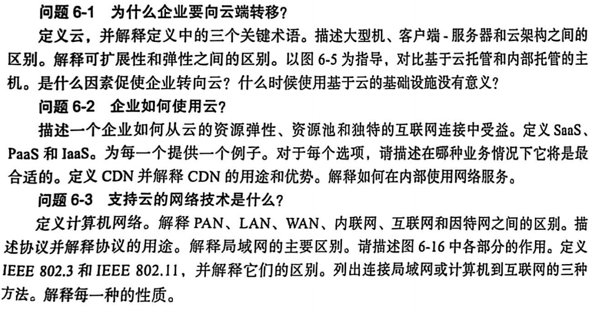
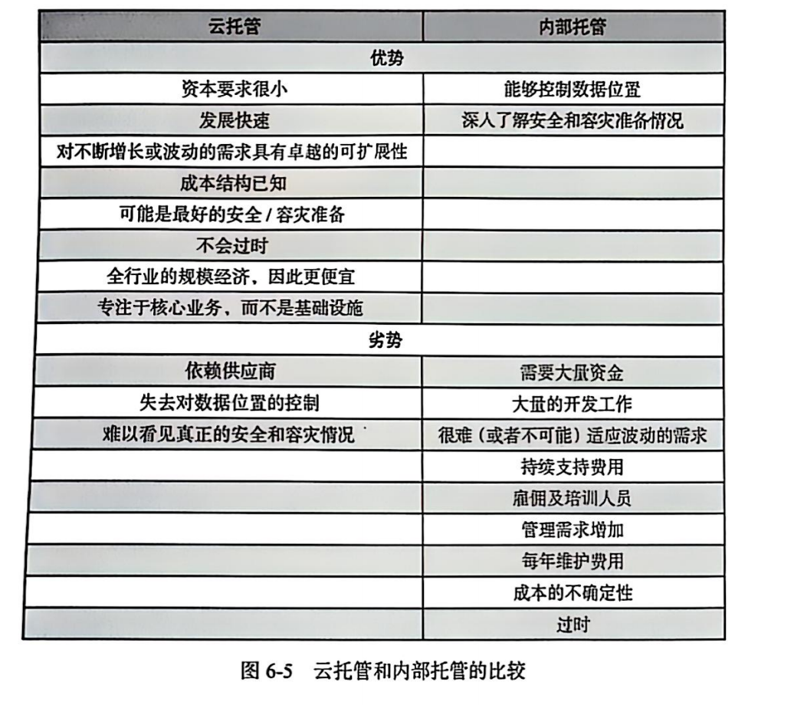
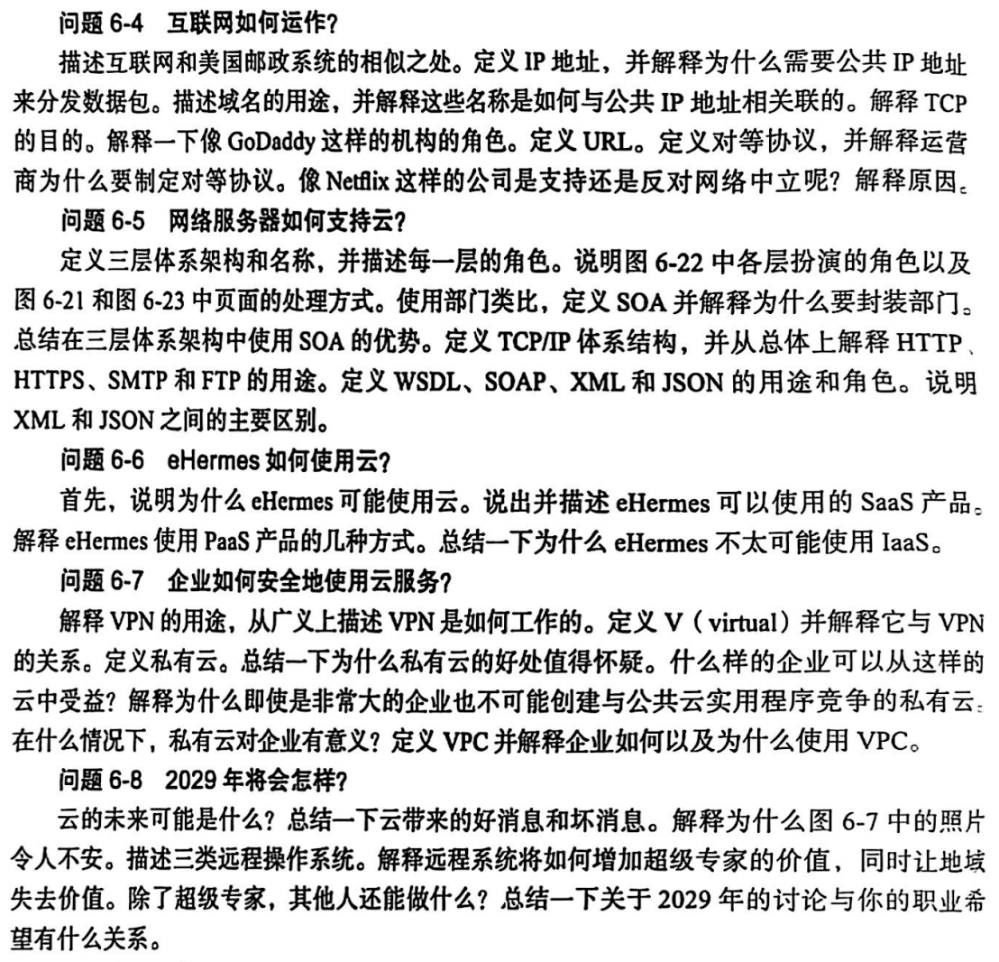
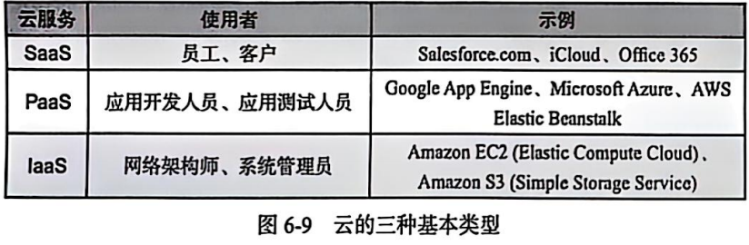
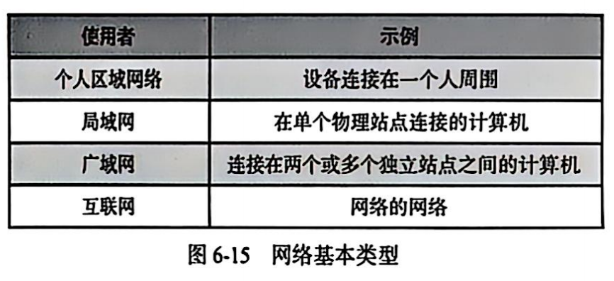

## 教材问题

1. 问
   - 通过互联网弹性租用的计算机资源池
   - 弹性：租用的计算资源可以在短时间内以编程的方式动态增加或者减少，企业只需要切他们使用的资源付费
   - 可扩展性：对需求的缓慢增量增长做出响应的能力
   - 
   - 根据法律或者行业标准实践要求，对数据进行物理控制的企业
2. 问

 - 获取云的方式：
   - 云供应商
   - 分发世界各地的服务器的内容
   - 内部使用web 服务，使用网络服务构建内部信息系统
     - **web**：是一个通过互联网访问的、由许多互相链接的超文本组成的系统，也称为万维网（World Wide Web）。它基于 HTTP 协议，用户可以通过浏览器访问各种网页、使用在线服务等，是一个广泛的信息资源和服务平台。
     - **json 文件**：JSON（JavaScript Object Notation）是一种轻量级的数据交换格式。JSON 文件则是以 JSON 格式存储数据的文件，文件扩展名为`.json`，它独立于编程语言，用于在不同系统、应用程序之间高效地传输和存储数据。

3. 问

- 协议就是一组用于企业通信的规则和数据结构。计算机需要协议交换数据
- 局域网是连接在单个站点上的一组计算机设备，半英里内
- IEEE802.3 协议用于有线局域网连接，也称为以太网；IEEE 802.11 协议是无线局域网使用的
- 将局域网连接到互联网的三种方式：
  - 数字用户线路
    - 在于语言电话相同的线路上工作
  - 电缆用户线路
    - 利用有线电视线路提高数据传输
  - 广域无线网连接
    - 。。。

4. 问

- 打包
- 在包裹上写名字（域名）
- 查找地址（IP 地址）
  - 互联网地址被称为 IP 地址
- 在包裹上注明地址（IP 地址）
- 在包裹上贴挂号信标签（TCP）
  - 保证数据包可靠传输的核心互联网协议
- 运输包裹（运营商运输的数据包）

- 亚马逊、网飞、雅虎支持网络中立

5. 问

- 三层架构
  - 用户层
  - 服务器层
  - 数据库层
- HTTP: 超文本传输协议，浏览器和网络服务之间的协议
- WSDL：web service description language，描述网络服务支持的服务输入输出和其他数据标准
- SOAP：请求网络服务和会送网络服务请求响应
- XML：可扩展标记语言，含有元数据
- JSON：JavaScript 对象简谱，传输文件的标记语言，大量数据

## 名词解释

**云服务类型：**

- 基础设施即服务，亚马逊s3
- 平台即服务，windows azure
- 软件即服务，onedrive

**网络类型：**

### 第一部分

1. **10/100/1000 以太网（10/100/1000 Ethernet）**：以太网标准，支持 10Mbps、100Mbps、1000Mbps 传输速率，适配不同网络带宽需求 。 
2. **蓝牙（Bluetooth）**：短距离无线通信技术，用于设备（如手机、耳机 ）间数据传输、连接，方便组网 。 
3. **电缆（Cable line）**：传输电信号或光信号的线缆，如网线、同轴电缆，是网络物理连接的基础 。 
4. **运营商（Carrier）**：提供通信网络服务的企业，负责建设、维护网络，为用户提供上网、通话等服务 。 
5. **客户端 - 服务器架构（Client - server architecture）**：网络架构，客户端请求服务，服务器响应并提供资源（如网页、数据 ），实现交互 。 
6. **云（Cloud）**：通过网络提供计算、存储、服务的模式，用户按需使用远程资源，无需本地搭建 。 
7. **云计算架构（Cloud computing architecture）**：支撑云计算服务的体系结构，包含基础设施、平台、软件等层级，实现资源灵活分配 。 
8. **商业服务器（Commerce server）**：用于商业场景（如电商 ）的服务器，提供商品展示、交易处理、订单管理等服务 。 
9. **计算机终端（Computer terminal）**：可接入网络，与服务器交互的设备，如电脑、瘦客户端，实现数据输入输出 。 
10. **内容分发网络（Content Delivery Network，CDN）**：分布式网络，通过边缘节点缓存内容（如网页、视频 ），加速用户访问 。 
11. **数据库层（Database tier）**：软件架构中，负责数据存储、管理、查询的层级，支撑应用数据读写 。 
12. **数字用户线路（Digital Subscriber Line，DSL）**：利用电话线传输数据的宽带技术，让用户通过普通电话线路高速上网 。 
13. **URL（Domain name）**：网站的易记名称（如 baidu.com ），映射到 IP 地址，方便用户访问 。 
14. **域名系统（Domain Name System，DNS）**：将域名转换为 IP 地址的系统，通过域名服务器解析，实现网络访问 。 
15. **弹性（Elastic）**：云计算等场景中，资源可根据需求自动扩展、收缩，灵活适配业务变化 。 
16. **封装（Encapsulated）**：网络中，数据添加头部、尾部信息（如协议字段 ），形成可传输单元（如数据包 ）的过程 。 
17. **以太网（Ethernet）**：局域网常用的网络技术，定义了数据传输的帧格式、介质访问控制等标准 。 
18. **文件传输协议（File Transfer Protocol，FTP）**：用于在网络上进行文件上传、下载的协议，实现不同主机间文件传输 。 
19. **跳（Hop）**：数据包在网络中经过的路由器数量，每经过一个路由器即一跳，反映网络路径长度 。 
20. **超文本传输安全协议（HTTPS）**：HTTP 的安全版本，通过加密、认证，保障网络通信中数据的机密性、完整性 。 
21. **超文本传输协议（Hypertext Transfer Protocol，HTTP）**：用于在 Web 浏览器和服务器间传输超文本（如网页 ）的协议，是 Web 基础 。 
22. **互联网名称与数字地址分配机构 ICANN（Internet Corporation for Assigned Names and Numbers）**：负责全球互联网域名、IP 地址分配及管理的机构，保障网络标识唯一性 。 

### 第二部分
1. **IEEE 802.3 协议（IEEE 802.3 protocol）**：以太网的 IEEE 标准，规定有线局域网的物理层和数据链路层规范 。 
2. **IEEE 802.11 协议（IEEE 802.11 protocol）**：无线局域网（WLAN ）的 IEEE 标准，定义无线通信的技术规范，如 Wi - Fi 。 
3. **基础设施即服务（Infrastructure as a Service，IaaS）**：云计算服务模式，提供服务器、存储、网络等基础设施资源，用户按需租用 。 
4. **互联网（Internet）**：全球范围内，由多个网络互联而成的庞大计算机网络，实现信息共享、交互 。 
5. **互联网交换中心（Internet Exchange Points，IXP）**：不同网络运营商互联的节点，用于交换网络流量，提升网络互通效率 。 
6. **互联网服务提供商（Internet Service Provider，ISP）**：为用户提供互联网接入、相关服务（如域名、托管 ）的企业 。 
7. **内联网（Intranet）**：企业或组织内部的专用网络，基于互联网技术，实现内部资源共享、通信 。 
8. **IP 地址（IP address）**：网络中设备的唯一标识，用于定位、通信，分为 IPv4 和 IPv6 格式 。 
9. **IPv4**：互联网协议第四版，32 位地址，是广泛使用的 IP 地址格式，但地址资源逐渐枯竭 。 
10. **IPv6**：互联网协议第六版，128 位地址，解决 IPv4 地址不足问题，支持更多设备联网 。 
11. **局域网（Local Area Network，LAN）**：局部范围内（如办公室、校园 ）的计算机网络，实现设备互联、资源共享 。 
12. **大型机体系结构（Mainframe architecture）**：大型计算机的体系设计，具备高可靠性、高并发处理能力，用于企业关键业务 。 
13. **大型机（Mainframe）**：高性能、高可靠性的计算机，处理大规模数据和复杂任务，常用于金融、政府等领域 。 
14. **网络中立（Net neutrality）**：网络运营商平等对待所有网络流量，不差别限制或收费，保障网络公平性 。 
15. **网络（Network）**：多台设备通过通信链路连接，实现数据传输、资源共享的系统 。 
16. **基于互联网（Over the Internet）**：通过公共互联网实现连接、通信或服务交付，无需专用网络 。 
17. **包（Packet）**：网络中传输的数据单元，包含头部（控制信息 ）和载荷（数据 ），便于分段、路由 。 
18. **对等（Peering）**：网络运营商间直接互联，交换流量，减少中转，提升网络性能 。 
19. **个人区域网络（Personal Area Network，PAN）**：个人周边短距离（如蓝牙范围 ）的网络，连接手机、耳机、手环等设备 。 
20. **平台即服务（Platform as a Service，PaaS）**：云计算服务模式，提供开发、运行平台（如操作系统、数据库 ），用户基于平台开发应用 。 
21. **池（Pooled）**：资源（如服务器、存储 ）被集中管理、动态分配，形成资源池，提高利用率 。 
22. **私有云（Private cloud）**：为单一组织专属的云计算环境，部署在本地或托管，保障数据安全、可控 。 
23. **私有 IP 地址（Private IP address）**：局域网内使用的非公开 IP 地址，用于内部通信，需通过 NAT 转换访问外网 。 
24. **协议（Protocol）**：网络设备间通信的规则约定，规定数据格式、传输流程、错误处理等，如 TCP、HTTP 。 
25. **公共 IP 地址（Public IP address）**：全球唯一可路由的 IP 地址，用于设备直接接入互联网，实现公网通信 。 
26. **远程操作系统（Remote action system）**：允许用户远程访问、控制计算机操作系统的技术，实现异地操作 。 
27. **路由器（Router）**：网络设备，用于连接不同网络，根据 IP 地址转发数据包，实现网络互联、路由选择 。 
28. **可扩展性（Scalable）**：系统、网络等可通过增加资源（如服务器 ），适应业务增长，提升性能 。 
29. **服务器层（Server tier）**：软件架构中，提供服务、处理业务逻辑、存储数据的服务器层级 。 
30. **面向服务架构（Service - Oriented Architecture，SOA）**：将应用拆分为独立服务，通过标准接口交互，实现灵活、可复用的系统架构 。 
31. **简单邮件传输协议（Simple Mail Transfer Protocol，SMTP）**：用于发送电子邮件的协议，规定邮件传输的流程、格式 。 
32. **居家办公（Small Office/Home Office，SOHO）**：个人或小型团队在家中开展办公的模式，依赖网络、远程协作工具 。 
33. **软件及服务（Software as a Service，SaaS）**：云计算服务模式，通过网络提供软件应用（如在线办公软件 ），用户按需使用 。 
34. **TCP/IP 协议架构（TCP/IP protocol architecture）**：由 TCP、IP 等协议组成的网络协议体系，是互联网通信的基础 。 
35. **远程执法（Telelaw enforcement）**：利用网络、通信技术，实现远程的执法监督、证据采集、指挥等工作 。 
36. **远程医疗（Telemedicine）**：通过网络、通信技术，实现远程诊断、医疗咨询、健康管理等医疗服务 。 
37. **远程手术（Telesurgery）**：借助机器人、网络技术，医生远程操控设备进行手术操作的医疗方式 。 
38. **因特网（The Internet）**：全球互联的计算机网络，即互联网，提供信息交互、服务访问等功能 。 
39. **瘦客户端（Thin client）**：依赖服务器处理数据、运行应用的轻量级客户端设备，本地资源需求少 。 
40. **三层架构（Three - tier architecture）**：软件架构分为表示层、业务逻辑层、数据访问层，层次清晰，便于维护、扩展 。 
41. **传输控制协议（Transmission Control Protocol，TCP）**：面向连接的传输层协议，保障数据可靠传输，如网页浏览、文件下载常用 。 
42. **隧道（Tunnel）**：在网络中建立的虚拟通道，用于封装、传输其他协议数据，实现跨网络通信（如 VPN ）。 
43. **统一资源定位符（Uniform Resource Locator，URL）**：标识互联网资源（如网页、文件 ）的地址，包含协议、域名、路径等 。 
44. **用户层（User tier）**：软件架构中，直接与用户交互的层级（如网页界面、App 界面 ），负责展示、操作 。 
45. **虚拟私有云（Virtual Private Cloud，VPC）**：在公有云平台中，为用户专属的隔离网络环境，按需配置网络、计算资源 。 
46. **虚拟专用网络（Virtual Private Network，VPN）**：通过公用网络建立加密通道，实现安全的远程连接、访问内网资源 。 
47. **无线广域网（WAN wireless）**：覆盖广域范围的无线网络，提供移动、远程的无线通信服务 。 
48. **网页（Web page）**：通过浏览器访问的文档，由 HTML 等技术构建，包含文字、图片、链接等内容 。 
49. **网络服务器（Web server）**：提供网页、Web 应用服务的服务器，响应客户端 HTTP 请求，传输内容 。 
50. **广域网（Wide Area Network，WAN）**：覆盖广阔地理范围（如城市、国家 ）的网络，实现远距离数据传输、互联 。