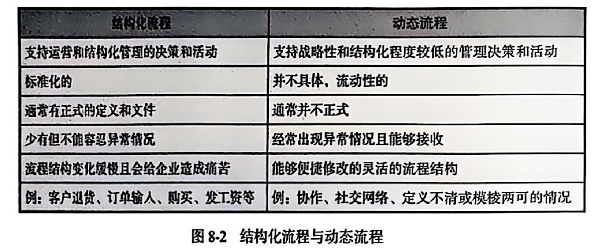
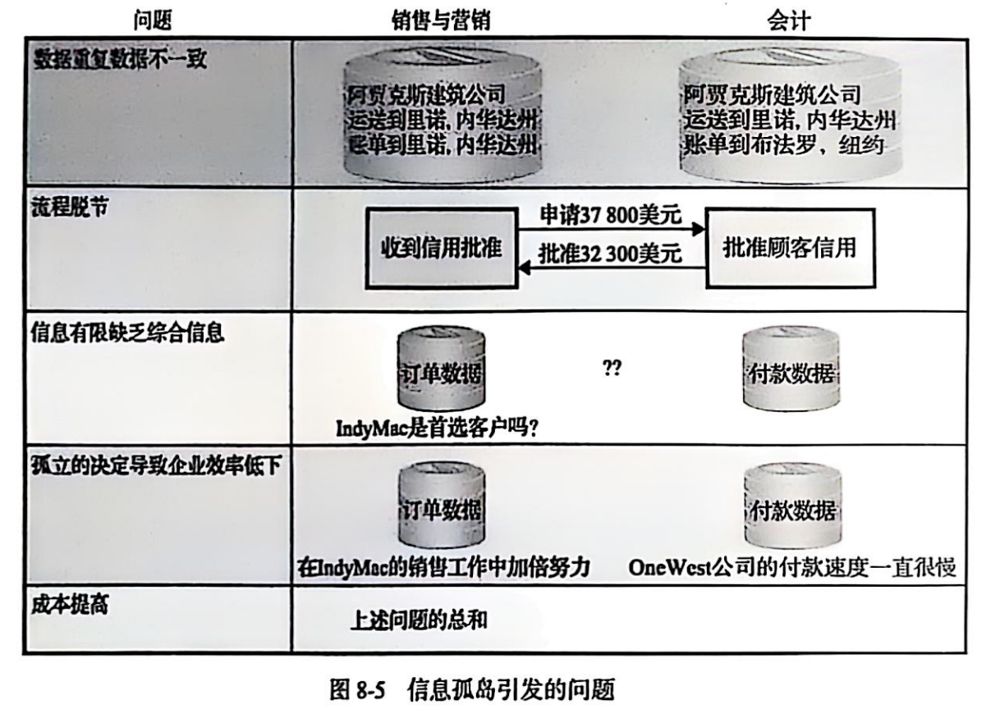

## 教材问题

**流程：**

- 在企业中的三种级别的应用：
  - 工作组流程
  - 企业流程
  - 企业间流程

**企业提高流程的质量的方式：**

- 改变流程结构
- 改变流程资源
- 同时改变流程结构和资源

**信息系统提高流程的质量：**

- 完成一项辅助活动
- 辅助人完成活动
- 控制数据质量和流程进程

**信息系统消除信息孤岛：**

- 将数据整合到一个数据库，并修改应用程序和业务流程以使用该数据库。

**CRM、ERP、EAI 支持企业流程：**

- CRM 是客户关系管理系统，一套应用程序、数据库和一组用于管理与客户所有互动的固有流程，以从潜在的客户生成客户服务。

- 企业资源规划是一套称为模块的应用、数据库，以及一组将业务操作合并为一个单一的、一致的计算机平台的固有程序。ERP 系统是基于ERP 技术的信息系统。
- EAI 企业应用集成是一套软件程序，将应用联系在一起的软件层这个和所有系统。

**企业 ERP 的要素：**

- 硬件
- ERP 应用程序
- ERP 数据库
- 业务流程程序
- 培训和咨询

**升级和应用企业信息系统的挑战：**

- 协作管理
- 需求差距
- 过度问题
- 员工抵触
- 新技术

## 名词解释

1. **企业流程重组（Business process reengineering）**：对企业流程进行根本性再思考、彻底性再设计，以大幅提升效率、质量等绩效 。 
2. **客户生命周期（Customer life cycle）**：客户与企业建立关系到关系结束的全过程，涵盖获取、留存、发展、流失等阶段 。 
3. **客户关系管理系统（Customer relationship management system）**：用于管理企业与客户交互的系统，记录客户信息、跟踪销售、优化服务，提升客户满意度与忠诚度 。 
4. **数据整合（Data integrity）**：将分散数据合并、清理，确保数据准确、一致、完整，支撑有效决策 。 
5. **分布式系统（Distributed system）**：由多个独立节点通过网络连接，协同完成任务的系统，可提升性能、可靠性 。 
6. **动态流程（Dynamic processes）**：流程步骤、规则随环境、需求动态变化，灵活响应业务不确定性 。 
7. **企业应用集成（Enterprise Application Integration，EAI）**：将企业不同应用系统（如 ERP、CRM ）连接，实现数据共享、流程协同 。 
8. **企业信息系统（Enterprise information system）**：为企业运营、管理提供信息支持的系统，涵盖流程自动化、数据管理、决策辅助等功能 。 
9. **企业流程（Enterprise processes）**：企业为实现目标开展的一系列活动、任务，如生产流程、销售流程，支撑业务运转 。 
10. **企业资源规划（Enterprise Resource Planning，ERP）**：整合企业资源（人、财、物等 ），实现流程自动化、信息集成的管理理念与系统，优化资源配置 。 
11. **企业资源规划系统（ERP system）**：基于 ERP 理念的软件系统，涵盖财务、生产、供应链等模块，统一管理企业业务 。 
12. **职能应用（Functional application）**：针对企业单一职能（如财务、人力资源 ）开发的应用，满足特定业务需求 。 
13. **职能信息系统（Functional information system）**：为企业某一职能领域（如营销、研发 ）提供信息处理、决策支持的系统 。 
14. **混合模式（Hybrid model）**：融合多种模式（如集中式与分布式、不同管理模式 ）的架构或方法，适配复杂业务需求 。 
15. **行业特定解决方案（Industry - specific solution）**：针对特定行业（如医疗、金融 ）业务特点、需求开发的定制化解决方案 。 
16. **信息孤岛（Information silo）**：企业内不同部门、系统间数据孤立，无法共享、交互，导致信息割裂的状态 。 
17. **固有流程（Inherent process）**：企业长期形成、相对稳定，嵌入日常运营的基础流程 。 
18. **企业间信息系统（Inter - enterprise processes system）**：连接多个企业，实现跨企业数据共享、流程协同的信息系统，支撑供应链、生态合作 。 
19. **企业间流程（Inter - enterprise process）**：涉及多个企业协作的业务流程，如供应链中的采购 - 生产 - 销售流程 。 
20. **模块（Module）**：系统中相对独立、具备特定功能的组件，可组合实现复杂业务，如 ERP 系统的财务模块 。 
21. **流程蓝图（Process blueprint）**：详细描述流程步骤、角色、输入输出、规则的可视化图表，用于流程设计、优化 。 
22. **流程效率（Process effectiveness）**：流程达成预期目标的程度，衡量流程输出与目标的契合度 。 
23. **流程有效性（Process efficiency）**：流程以最少资源（时间、成本 ）完成任务的程度，体现流程的经济性 。 
24. **自我效能感（Self - efficacy）**：个体对自身完成特定任务、达成目标能力的主观判断与信心 。 
25. **存储程序（Stored procedure）**：预先编写、存储在数据库中，可重复调用的程序代码，用于处理复杂数据操作 。 
26. **结构化流程（Structured process）**：流程步骤明确、规则清晰，可标准化、自动化执行的流程，如订单处理流程 。 
27. **培训师培训（Train the trainer）**：培养培训师的项目，让其掌握教学、培训技能，以便向他人传授知识 。 
28. **触发器（Trigger）**：数据库中，因特定事件（如数据插入、更新 ）自动执行的程序，用于维护数据完整性 。 
29. **工作组信息系统（Workgroup information system）**：支持工作组（如项目组、部门团队 ）协同工作、信息共享的系统，提升团队效率 。 
30. **工作组流程（Workgroup process）**：工作组内部开展的业务流程，聚焦团队协作完成特定任务，如项目开发流程 。

