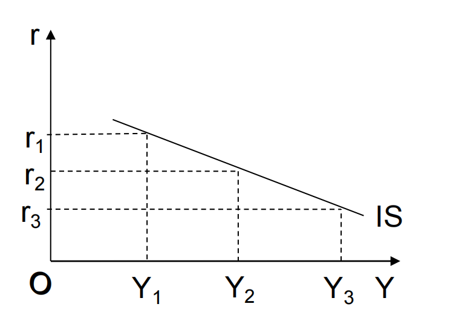
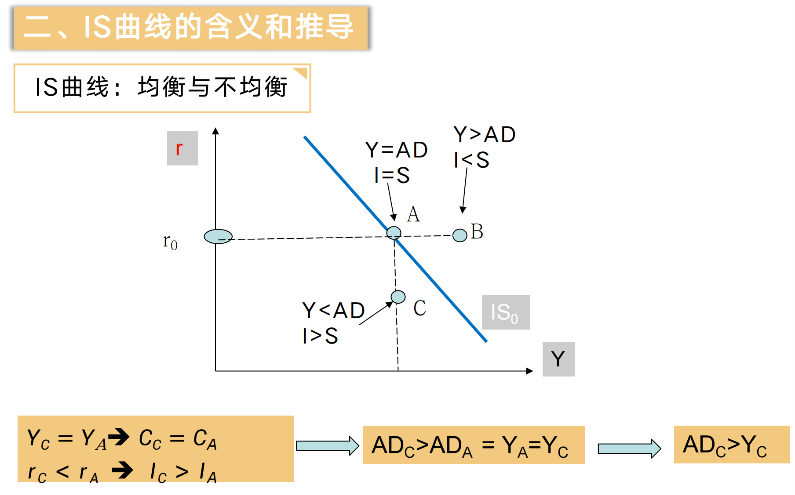
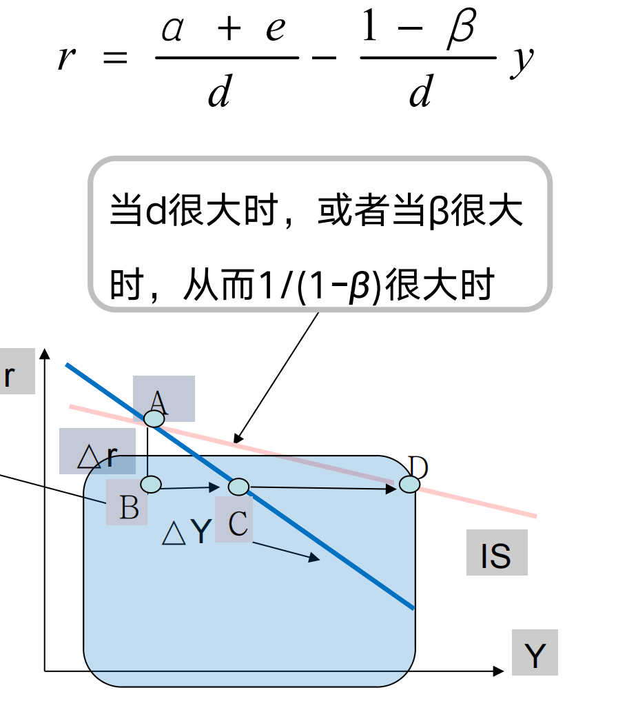
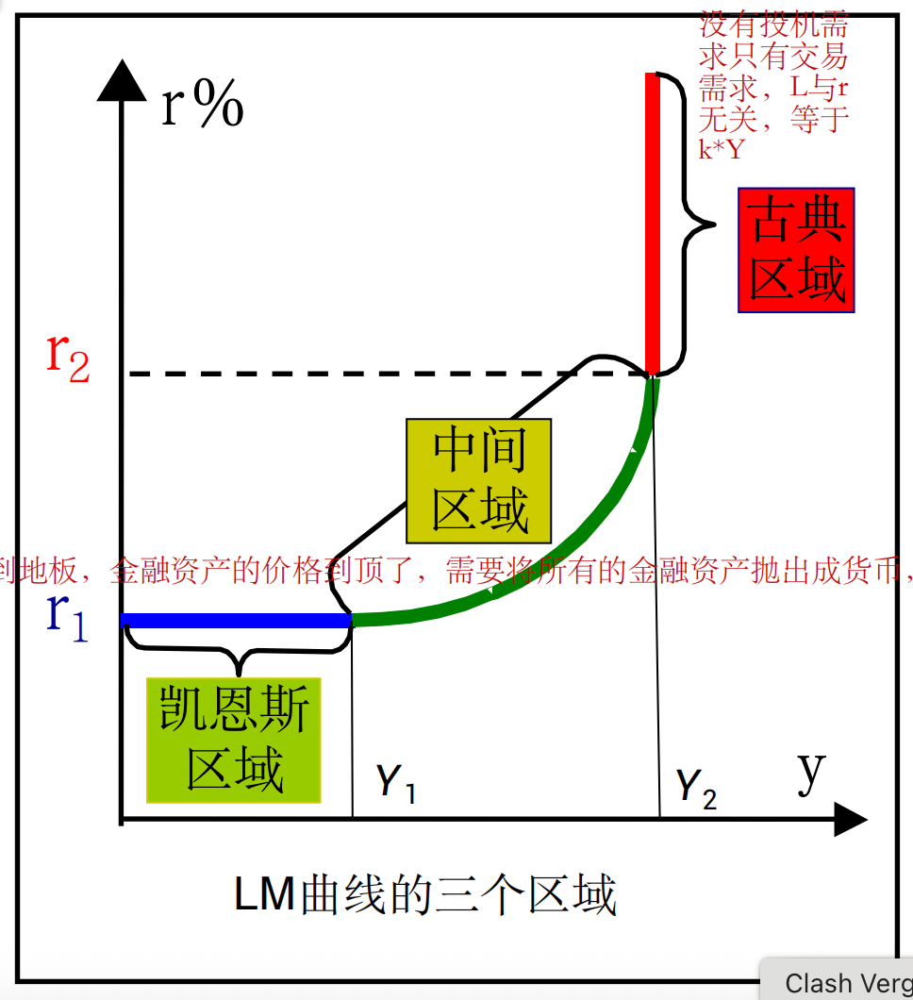

# Chapter 11

## 产品市场的均衡：IS 曲线

I，S 相等就是储蓄和投资相等，**产品市场均衡**

关于 IS 曲线的推导：利用国民均衡收入方程和两部门消费函数得出
$$
AE=AD=C+I
=Y=C(Y)+I(r)=\alpha +\beta Y+e-dr
$$
得到 IS 曲线的方程
$$
Y=  \frac{\alpha+e-dr}{1-\beta}=Y(r)
$$
所以是 r ,Y 负相关,其中\(d\)是**投资对利率的敏感程度系数**，\(e\)是自发投资，与\(r\)没有关系；\(\beta\)是边际消费倾向 MPC

### 含义和推导

关键是要比较：Y 🆚 AD；I 🆚 S

- $IS_0$曲线：线上任意一点（如A点），都满足 **产品市场均衡条件**（$Y = AD$，即总产出=总需求；$I = S$，即投资=储蓄 ），是产品市场均衡时利率与国民收入的组合轨迹。

- **不同区域的不均衡状态** 

  - **A点（IS曲线上）**：是均衡点，满足 $Y = AD$、$I = S$ ，总产出与总需求匹配，投资和储蓄平衡。  

  - **B点（IS曲线右上方）**：$Y>AD$（总产出>总需求 ）、$I<S$（投资<储蓄 ）。因为利率$r$高，投资$I$被抑制（$I$与$r$反向变动 ），储蓄$S$相对多（$S$与$Y$正相关，$Y$给定下，高$r$让储蓄意愿强 ），导致总需求不足，产出过剩。  

  - **C点（IS曲线左下方）**：$Y<AD$（**总产出<总需求** ）、$I>S$（投资>储蓄 ）。**利率$r$低，刺激投资$I$增加，储蓄$S$相对少（低$r$降低储蓄意愿 ），总需求旺盛**，产出不够，**企业会扩大生产**，推动$Y$上升，向均衡靠拢 。 

说白了就是利率过高会抑制需求，导致产出高于总需求\(AD\)

这意味着投资对利率越敏感，利率变动引起的国民收入变动幅度越大，IS 曲线就越平坦 

- IS 曲线的斜率仅仅取决于投资对于消费敏感程度\(d\)和投资乘数\(\frac{1}{1-\beta}\)
- 各项**自发**支出增加的时候，IS 曲线右移

## 货币市场的均衡：LM 曲线

#### LM 曲线的推导

实际货币需求的决定，***凯恩斯的流动性偏好理论（Liquidity Preference Theory）*认为，人们持有货币（即流动性偏好）的动机有三种：**

- 交易动机（Y） 
- 预防动机（Y）
- 投机动机（r）

- 实际**货币需求**：L

- 名义**货币需求**：M

- $$
  L=(M/P)^d
  $$

  

货币需求是实际货币需求：
$$
L=L（Y，r）=L_{1}(Y)+L_{2}(r)=k\cdot Y-h\cdot r
$$
其中**k** 是**货币需求对收入的敏感性**，**h** 是**货币需求对利率的敏感性**

由公式 (4) 以及 L=M 可以推导出 LM 曲线的表达式
$$
Y=\frac {h\cdot r+M}{k}=\frac{hr}{k}+\frac{M}{k}=Y(r)
$$
以及
$$
r=\frac{k\cdot Y-M}{h}=\frac{kY}{h}-\frac{M}{h}=r(Y)
$$
(5)(6)都是 LM 曲线的表达式

关键是比较 L🆚M

### **LM 曲线的含义：**

货币市场均衡曲线，货币需求均衡时候（货币需求=货币供给）所有利率和收入水平的组合，沿着这条曲线货币市场处于均衡。

### **LM 曲线的性质和移动：**

#### 斜率

- 对于 (7) 而言，斜率为正，货币需求对收入 Y 变化越敏感，k 会越大，斜率越大，LM 越陡峭
- k 不变，货币需求对利率的敏感性越大，曲线斜率越小

也就是说，h (货币对利润越敏感)变大会引起曲线变得平缓，k (货币对产出越敏感)变大会引起曲线变得陡峭

#### 曲线上三个区域

凯恩斯区域 🆚 古典区域

- 凯恩斯区域：利率足够低导致货币需求对于利率无限敏感，h->♾️，**需要采取财政政策**
- 古典区域：利率足够高，导致货币需求对于收入无限敏感但是对于利率完全不敏感，**采取货币政策**
- 中间区域

**流动性：**

是指一项资产在不损少其原有价值的前提下兑换成货币的难易程度。

**流动性偏好：**

- 在同等风险和收益条件下，人们最偏好持有流动性最大的资产
- 货币流动性最大->流动性偏好=货币需求。

**流动性陷阱：**

当利率足够低，人们愿意持有任意供给数量的货币在手中，即货币需求对利率无限敏感。“货币的投资动机变得无限大”，这就是“凯恩斯陷阱”。

<!--由于投机动机，当利率高人们倾向于将货币转入债券市场，减持流动货币；反之增持货币-->

#### 投机需求对于 LM 变动影响

反向，都去投机了没人搞交易，没人做实事，生产总值下降

#### 交易需求对于 LM 变动影响

反向，交易需求 上升说明相同的交易需要的钱变得多了，相同的钱交易量变少了

#### 实际货币供给对于 LM 的变动

价格与 LM 变动相反

## IS-LM 模型

任何不均衡都会趋向于均衡点 E（交点）

**挤出效应：**

政府借款多了引起r 上升借款成本上升，占用的资金变多了，民间的支出减少了，收入没有增加（本来 的扩张没有作用）