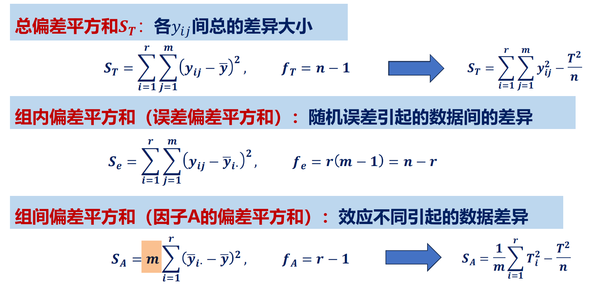
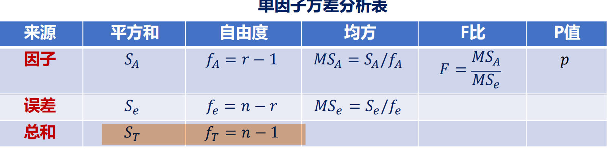

# 方差分析

**ANOVA：**
分析多个样本均值差异的方法，判断自变量因变量是否存在显著影响。
1. 检验多个（>=3）个样本均值之间是否存在显著差异
2. 本质是组间方差/组内方差，越大说明差异越显著，越接近 1 说明没有你显著影响
3. 需假设：
   - 正态性
   - 方差齐性
   - 独立性（观测样本之间）
4. 其他检验：
   - t检验是对于两组样本，三组以上用方差检验
   - 回归分析是连续自变量对因变量，方差分析是分类变量对因变量（特殊的回归分析）

# 单因子方差分析
简而言之就是比较所有水平的均值是否相同

## 重复数相等的情形

$S_T$:**（Total Sum of Squares）**
$S_A$:**Sum of Squares Among Groups**
$S_e$:**Sum of Squares due to Error**
$S_T=S_A+S_e$
比较均方：
$MS_A=\frac{S_A}{f_A}$
其中$f_A=n_A-1=r-1$
$MS_e=\frac{S_e}{n-r}$
检验统计量 $F=\frac{MS_A}{MS_e}=\frac{\frac{S_A}{f_A}} {\frac{S_e}{f_e}}$
$F$过大拒绝，$W=\{F>=F_{1-\alpha}(f_A,f_e)\}$
其中$n=r*m$，$r$是水平数量，$m$是实验次数
$p-value=1-F(F_0;f_A,f_e)$
当$p-value<\alpha$和$F_0>F_{1-\alpha}(f_A,f_e)$都说明了拒绝原假设$H_0$认为所研究的因子对因变量有显著影响。

简易表达：
- $S_T=\sum_{i=1}^r\sum_{j=1}^m(y_{ij}-\bar{y})^2=\sum_{i=1}^r\sum_{j=1}^m y_{ij}^2-\frac{T^2}{n}$其中$T$是所有数据的总和。
- 
$$
S_A=m\sum_{i=1}^rT_{i}^2-\frac{T^2}{n}
$$

其中
$$
p=P(F(f_{A},f_e)\geq F_{calculated})
$$
## 重复数不等情形

$m_1,m_2,...m_i,...$是不同水平的实验的重复次数
$$
S_T=\sum_{i=1}^{r}\sum_{j=1}^{m_i}(y_{ij}-\bar{y})^2=\sum_{i=1}^{r}\sum_{j=1}^{m_i} y_{ij}^2-\frac{T^2}{n}$$
$$
S_A=\sum_{j=1}^{r}m_j(\bar y_j- \bar y)^2=\sum_{j=1}^{r}\frac{T_j^2}{m_j}-\frac{T^2}{n}
$$
$$ f_T=n-1$$

# 多重比较

比较两两水平的均值是否相同（各个原假设有一个不成立就构成多重比较）

1. T法
$$
临界值=q_{1-\alpha}(r,f_{e})\hat \sigma/m^{0.5}
$$
2. S 法
$$
c_{ij}=\sqrt{(r-1)F_{1-\alpha}(r-1, f_{e})(\frac{1}{m_{i}}+\frac{1}{m_{j}})\hat \sigma^2}
$$
3. Fisher 最小显著差异方法

$$
t_{ij} = \frac{\bar{y}_{i} - \bar{y}_{j}}{\sqrt{MSE \left( \frac{1}{n_{i}} + \frac{1}{n_{j}} \right)}} \sim t(n - r)
$$

# 方差齐性检验

---
# F 检验

在回归分析中，**F检验（F-test）**是一种用于检验**整体模型显著性**的假设检验方法，主要用于判断**自变量整体是否对因变量有显著影响**。它通过比较模型的解释能力与随机误差的大小，来评估回归模型的有效性。以下从原理、计算、解释及应用场景等方面详细说明：

