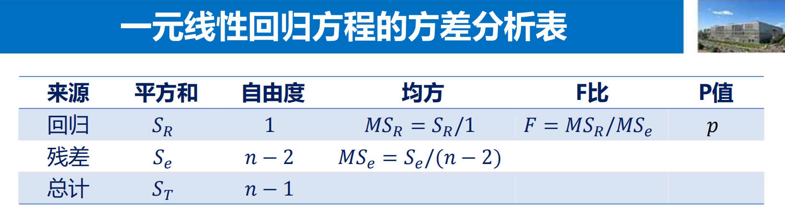
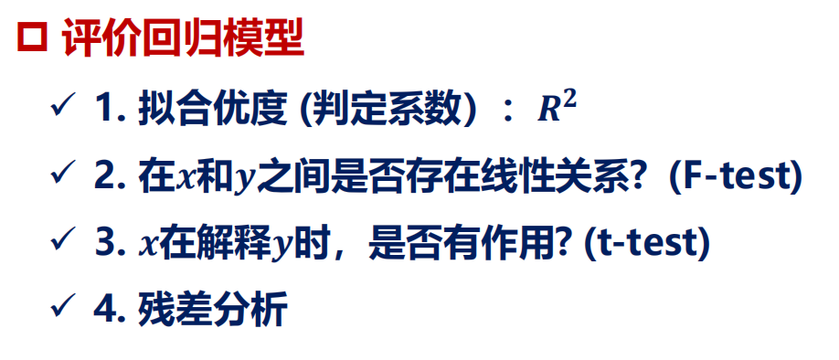

# 为什么

$$
\sum (x_i - \bar{x}) \cdot \bar{x} = 0
$$？
> $$
> \sum (x_i)=n\bar x,\sum x_i\bar x=n\bar x^2
> $$

$\hat{\beta}_1 =\frac {l_{xy}}{l_{xx}}=\frac {cov(x,y)}{var(x)}=\frac{\sum (x_i - \bar{x}) \cdot (y_i - \bar{y})}{\sum (x_i - \bar{x})^2}{}$

而$l_{xx}=\sum (x_i - \bar{x})^2$并且$\sum (x_i-\bar{x}) \cdot \bar{y}=0$所以$\hat{\beta}_1 =\frac{\sum (x_i - \bar{x}) \cdot (y_i - \bar{y})}{l_{xx}}=\frac{1}{l_{xx}} \cdot \sum (x_i - \bar{x}) \cdot y_i$

$E(\hat\beta_1)=\frac{1}{l_{xx}} \cdot \sum (x_i - \bar{x}) \cdot E(y_i)=\frac{1}{l_{xx}} \cdot \sum (x_i - \bar{x}) \cdot E({\beta}_0+\beta_1x_i)=\frac{1}{l_{xx}} \cdot \beta_1 \sum (x_i - \bar{x}) E(y_i)$

那么$E(\beta_1)=\frac{1}{l_{xx}} \cdot \sum(x_i-\bar{x}) \cdot E(y_i)$

---

# 最小二乘法

### 1. 从线性回归模型出发
设线性回归模型为 \(y = X\beta+\epsilon\) ，其中 \(y\) 是 \(n\times1\) 的因变量观测值向量，\(X\) 是 \(n\times(p + 1)\) 的设计矩阵（包含常数项和自变量观测值 ，第一列通常为全1 ），\(\beta\) 是 \((p + 1)\times1\) 的未知参数向量，\(\epsilon\) 是 \(n\times1\) 的随机误差向量 ，且满足 \(E(\epsilon)=0\) ，\(Cov(\epsilon)=\sigma^{2}I_{n}\)（\(I_{n}\) 是 \(n\) 阶单位矩阵 ）。

### 2. 最小二乘原理
最小二乘法的目标是找到 \(\hat{\beta}\) ，使得残差平方和 \(S(\beta)=(y - X\beta)'(y - X\beta)\) 最小。

将 \(S(\beta)\) 展开：
\[
\begin{align*}
S(\beta)&=(y - X\beta)'(y - X\beta)\\
&=y'y - y'X\beta-\beta'X'y+\beta'X'X\beta
\end{align*}
\]
因为 \(y'X\beta\) 是标量，且 \((y'X\beta)'=\beta'X'y\) ，所以 \(S(\beta)=y'y - 2\beta'X'y+\beta'X'X\beta\) 。

### 3. 求偏导数并令其为 0
对 \(S(\beta)\) 关于 \(\beta\) 求偏导数 \(\frac{\partial S(\beta)}{\partial\beta}\) ，根据矩阵求导规则：
\(\frac{\partial \beta'X'X\beta}{\partial\beta}=2X'X\beta\) ，\(\frac{\partial \beta'X'y}{\partial\beta}=X'y\) 
则 \(\frac{\partial S(\beta)}{\partial\beta}=- 2X'y + 2X'X\beta\) 。

令 \(\frac{\partial S(\beta)}{\partial\beta}=0\) ，得到：
\[
\begin{align*}
-2X'y + 2X'X\beta&=0\\
X'X\beta&=X'y
\end{align*}
\]

### 4. 求解 \(\beta\) 
当 \(X'X\) 可逆时（满秩条件 ），在等式 \(X'X\beta=X'y\) 两边同时左乘 \((X'X)^{-1}\) ，得到 \(\hat{\beta}=(X'X)^{-1}X'y\) ，这就是最小二乘估计量的表达式。 

Gauss - Markov定理则是在一定的假设条件下（如线性回归模型的基本假设 ：误差项零均值、同方差、不相关等 ），证明了在所有的线性无偏估计量中，最小二乘估计量具有最小的方差，是最优线性无偏估计量（BLUE）。 

---

# 相关系数

**Pearson 相关系数：**
$$
r=\frac{\sum_{i=1}^n(x_i-\bar{x})(y_i-\bar{y})}{\sqrt {\sum_{i=1}^n(x_i-\bar{x})^2}\sqrt {\sum_{i=1}^{n} (y_i-\bar{y})^2}}
$$
**Spearson 相关系数的平方：**
$$
R=1-2l=1-\frac{6\sum_{i=1}^nD_{i}^2}{n(n^2-1)}
$$
$\sum D_{i}^2=\sum_{i=1}^{n}(u_{i}-v_{i})^2$

# 一元线性回归

**拟合值/回归值：**
$$
\hat y_i=\hat \beta_0+\hat \beta_1x_i
$$

**最小二乘：LSE**
残差最小
$$
\hat \beta_1=\frac{l_{xy}}{l_{xx}}=\frac{\sum_{i=1}^n(x_i-\bar{x})(y_i-\bar{y})}{\sum_{i=1}^n(x_i-\bar{x})^2}
$$
$$
\hat \beta_{0}=\bar{y}-\hat \beta_1\bar{x}
$$

## 回归方程的显著性检验

假设$H_0:\beta_1=0$
备择假设 $H_1:\beta_1\neq0$

### 一、F检验的基本原理
#### 1. **核心思想**
- 假设所有自变量对因变量的影响均为零（即回归模型中所有回归系数均为零），此时模型无法解释因变量的变化，称为**原假设（\(H_0\)）**：  
  \[
  H_0: \beta_1 = \beta_2 = \dots = \beta_k = 0
  \]  
  （\(\beta_i\)为第\(i\)个自变量的回归系数，\(k\)为自变量个数）。  
- **备择假设（\(H_1\)）**：至少有一个自变量的回归系数不为零，即模型整体有效。
- **拒绝域：**$W=\{X; F >= F_{1-\alpha}(1, n-2)\}$

#### 2. **基于方差分解的逻辑**
- 因变量的总变异可分解为两部分：  
  - **回归平方和（SSR，Sum of Squares Regression）**：由自变量解释的变异，反映模型的有效性。  
  - **残差平方和（SSE，Sum of Squares Error）**：未被模型解释的随机误差。  
  - **总平方和（SST，Sum of Squares Total）**：  
    \[
    SST = SSR + SSE
    \]  

- **F统计量**通过比较回归平方和与残差平方和的相对大小构建，公式为：  
  \[
  F = \frac{SSR / k}{SSE / (n - k - 1)} = \frac{\text{回归均方（MSR）}}{\text{残差均方（MSE）}}
  \]  
  - \(n\)：样本量；  
  - \(k\)：自变量个数；  
  - \(SSR/k\)：回归均方（MSR），衡量自变量解释的平均变异；  
  - \(SSE/(n-k-1)\)：残差均方（MSE），衡量平均随机误差。  

- **直观理解**：若模型有效，SSR应显著大于SSE，F值会远大于1；若模型无效，SSR与SSE接近，F值接近1。

### 二、F检验的计算步骤
1. **计算平方和**  
   - **SST**：因变量观测值与均值之差的平方和：  
     \[
     SST = \sum_{i=1}^n (y_i - \bar{y})^2
     \]  
   - **SSR**：因变量预测值与均值之差的平方和：  
     \[
     SSR = \sum_{i=1}^n (\hat{y}_i - \bar{y})^2
     \]  
   - **SSE**：因变量观测值与预测值之差的平方和（残差平方和）：  
     \[
     SSE = \sum_{i=1}^n (y_i - \hat{y}_i)^2
     \]  

2. **计算自由度**  
   - 回归自由度：\(df_{回归} = k\)  
   - 残差自由度：\(df_{残差} = n - k - 1\)  
   - 总自由度：\(df_{总} = n - 1\)  

3. **计算F统计量**  
   \[
   F = \frac{SSR / k}{SSE / (n - k - 1)}
   \]  

4. **确定显著性**  
   - 根据自由度\(k\)和\(n-k-1\)，查F分布表或通过统计软件计算**p值**。  
   - 若\(p < \alpha\)（通常取0.05），则拒绝原假设，认为模型整体显著。

### 三、F检验的解释与应用场景
#### 1. **解释F检验结果**
- **显著（p < 0.05）**：自变量整体对因变量有显著影响，模型有效。  
- **不显著（p ≥ 0.05）**：自变量整体无法显著解释因变量的变化，模型无效（需重新审视变量选择或模型设定）。  

#### 2. **应用场景**
- **线性回归模型的整体有效性判断**：  
  无论简单线性回归（单个自变量）还是多元线性回归（多个自变量），F检验均用于检验模型整体是否有效。  
  - 对于简单线性回归，F检验与自变量的t检验等价（此时F = t²）。  
- **嵌套模型比较**（如检验增加新变量是否提升模型解释力）：  
  通过构造**似然比F检验**或**偏F检验**，比较复杂模型与简单模型的拟合优度差异。  
- **方差分析（ANOVA）**：本质上是F检验在组间均值差异比较中的应用。

### 四、F检验与t检验的区别
| **维度**         | **F检验**                          | **t检验**                          |
|------------------|------------------------------------|------------------------------------|
| **检验目标**     | 整体模型显著性（所有自变量联合影响） | 单个自变量的显著性（单个系数是否为零） |
| **统计量分布**   | F分布（右偏态）                    | t分布（对称）                      |
| **应用场景**     | 多元回归模型整体有效性、嵌套模型比较 | 单个系数检验、两组均值差异比较       |
| **结果解读**     | p < 0.05表示模型至少有一个自变量有效 | p < 0.05表示单个自变量显著         |

### 五、注意事项
1. **假设条件**  
   - 因变量与自变量之间存在线性关系；  
   - 残差服从正态分布、方差齐性且相互独立（即满足线性回归的经典假设）。  

2. **F值大小与实际意义**  
   - F值显著仅说明模型有效，但不代表自变量与因变量的实际关联强度（需结合R²、调整R²等指标）。  
   - 大样本下，即使自变量影响微弱，F检验也可能显著（需关注效应量）。  

3. **与R²的关系**  
   - R²（决定系数）表示自变量解释的总变异比例，与F值正相关：  
     \[
     F = \frac{R^2 / k}{(1 - R^2) / (n - k - 1)}
     \]  
     R²越大，F值通常越大，模型越可能显著。  

### 六、示例：一元线性回归中的F检验
假设用广告投入（\(x\)）预测销售额（\(y\)），得到：  
- \(n = 20\)，\(k = 1\)（单个自变量），\(SSR = 800\)，\(SSE = 200\)。  
- 计算F统计量：  
  \[
  F = \frac{800 / 1}{200 / (20 - 1 - 1)} = \frac{800}{12.5} = 64
  \]  
- 自由度：\(df_1 = 1\)，\(df_2 = 18\)。  
- 查F分布表，\(F_{0.05}(1,18) = 4.41\)，由于64 > 4.41，p值远小于0.05，模型显著，说明广告投入对销售额有显著影响。

### 总结
- **F检验是回归分析中判断模型整体有效性的核心工具**，通过比较自变量解释的变异与随机误差，检验所有回归系数是否同时为零。  
- 若F检验显著，表明模型中至少有一个自变量对因变量有影响，但具体哪些变量显著需结合t检验进一步分析。  
- 实际应用中需注意假设条件，并结合效应量指标（如R²）综合评估模型质量。

>
>$$
>S_R=\hat \beta_1^2 l_{xx}
>$$

### t检验

P16
> t检验的原假设：
> $$
> H_0: \beta_1=0
> $$
> 检验统计量：
> $$
> t=\frac{\hat \beta_1-0}{\hat \sigma/\sqrt{l_{xx}}} (因为\hat \beta_1 \sim N(\beta_1, \frac{\sigma^2}{l_{xx}}))
> $$
> \(t\) 越大越拒绝

### 相关系数检验

$$
r=\frac{l_{xy}}{\sqrt{l_{xx}\cdot l_{yy}}}
$$

### 评价

**判定系数：**
$$
R^2=\frac{SSR}{SST}=1-SSe/SST
$$

**残差分析：**
证明拟合优度好；残差\(e\)是对误差\(\epsilon\)的估计

---
>  样本方差
> $$ \text{var}(x) = \frac{1}{n-1} \sum_{i=1}^{n} (x_i - \bar{x})^2 $$
> 总体方差
> $$ \text{var}(x) = \frac{1}{n} \sum_{i=1}^{n} (x_i - \bar{x})^2 $$
> 卡西欧中
> 样本标准差:\(sx^2\)
> 总体方差:\(\sigma^2\)