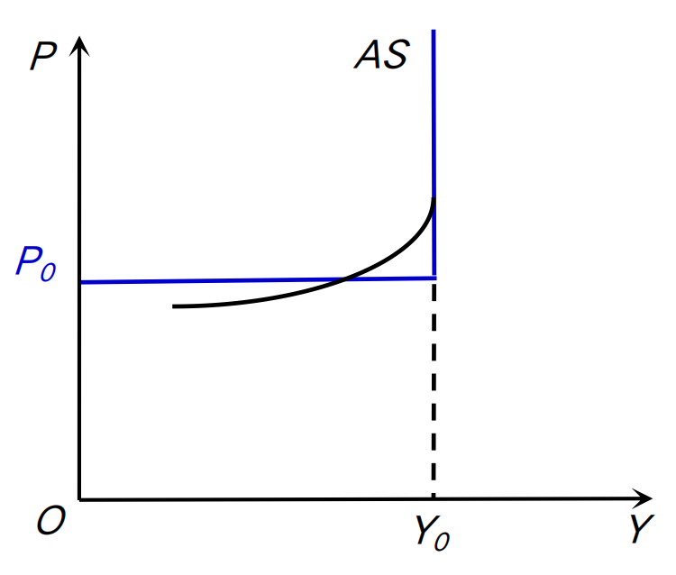
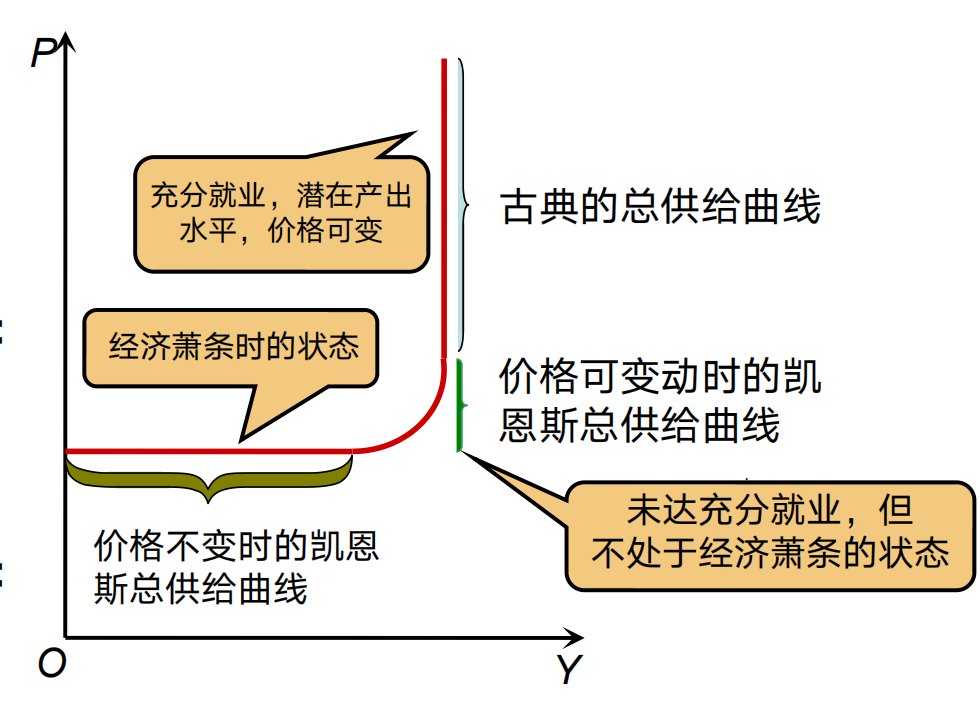
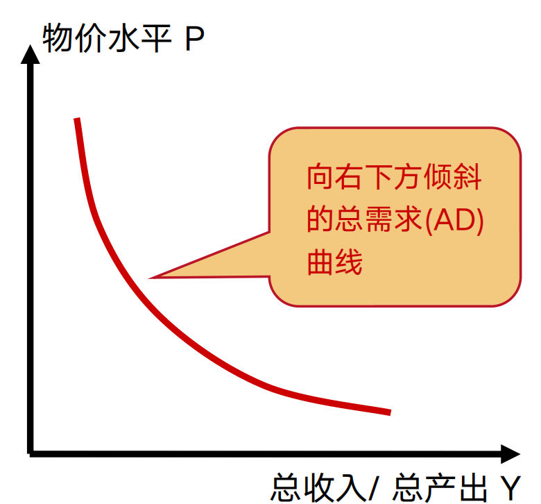

# AD-AS 模型

总供求模型

- 推翻物价水平不变的假定，考察物价和国民收入之间 的关系
- AD-AS 在P-Y 坐标，IS-LM在r-Y 
- 名义货币供给不变，产品和货币市场同时均衡，P 与 Y 关系（GDP）
- 解释短期经济波动

## 总供给曲线以及变动

- 长期：LRAS
  - 货币中性，垂直曲线；产出受到要素技术等制约与价格水平无关

- 短期：SRAS
  - 凯恩斯货币非中性

**曲线：反 L 曲线**

Y_{0}之前是供给决定于需求，之后是决定与技术进步劳动力等，调整需求只会产生通胀

**古典区域🆚凯恩斯区域，类比 IS-LM 模型：**

- 价格不变区域没有达到充分就业（只有自然失业率）
- 长期达到了充分就业

**变动：**

- 技术进步
- 劳动需求增加
- 劳动供给增加
- 未来物价下降                    -------------------->AS 右移

## 总需求曲线以及变动 

推导：

IS-LM 曲线联立：Y=AD（P），关系为负，方程是Y =Y(P)

**变动：**

T 下降和 G 上升，消费信心上升都会使得AD 右移

## 总供给-总需求模型

### 短期-凯恩斯区域

- 失业
- 产能过剩

#### 价格可变，AS 弧形区

AS 曲线向着右上方倾斜

#### 价格不变，AS 水平区

AS 曲线水平

### 长期-古典区域

AS 曲线垂直与P 价格水平无关

## 总供给-总需求模型对外来冲击的反应

### 财政政策-T，G，N

只会引发 AD 曲线的同向移动

### 货币政策

#### 短期

凯恩区域，凯恩斯陷阱，流动性陷阱，不会影响 AD 曲线的移动，不变

#### 长期

AD 同向变化，AS 不变，通胀 only

#### 总结

从左到右，AS 曲线从平缓到陡峭，财政政策作用递减

### 生产力变动

#### 凯恩斯区域

P 影响不大，过剩生产力

#### 古典区域

AS 正向移动，P 下降，Y 上升

### 一般物价冲击

#### 短期

AS 移动，AD 不动

#### 长期

AS 一般不动
