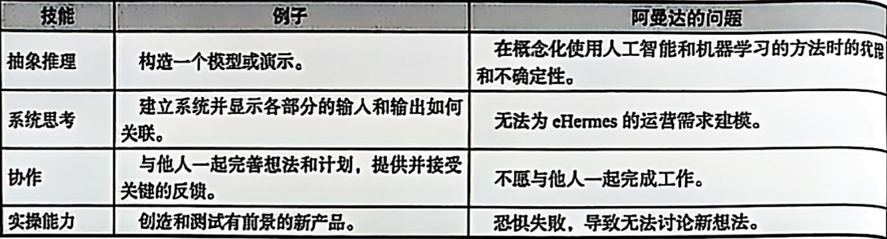
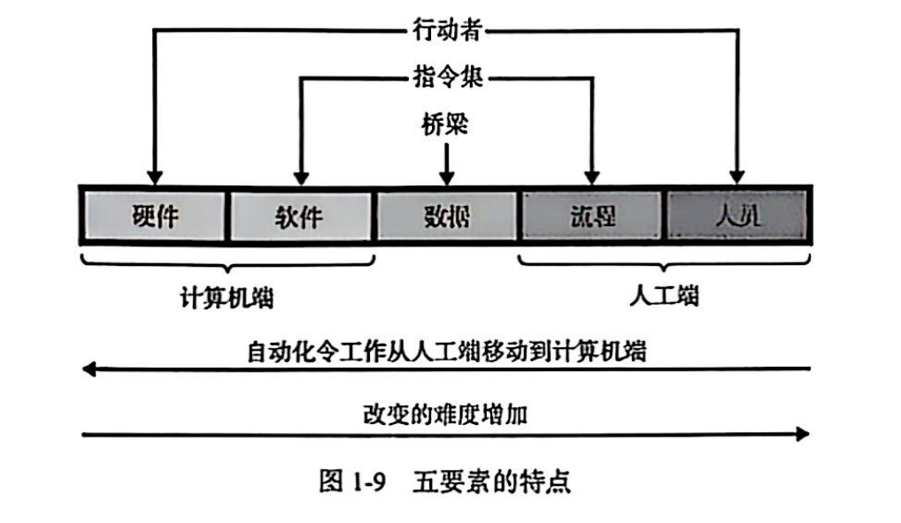
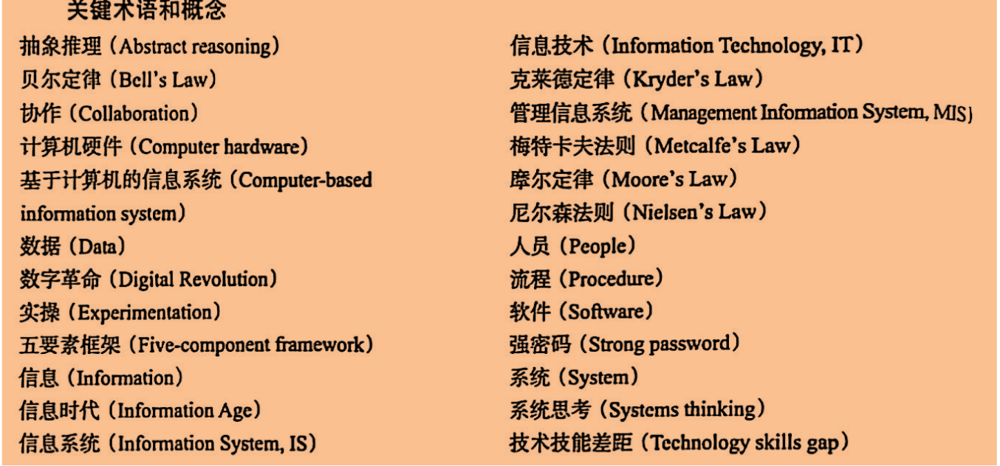

## 数字革命

数字革命是指自20世纪70年代起，从机械和模拟器件向数字设备转换，借数字设备连接、共享数据及快速发展，给个人、公司和社会带来巨大变革的信息时代重要变革 。

**推动数字革命的因素如下：**

- **技术定律驱动**：
    - **摩尔定律**：1965 年英特尔联合创始人戈登·摩尔提出，电子芯片设计和制造技术进步，使得芯片上平均每平方英寸的晶体管数量每18个月翻一番，计算机处理器性价比越来越高，推动了数字设备性能提升和成本下降，为数字革命奠定硬件基础。
    - **梅特卡夫定律**：以太网发明者罗伯特·梅特卡夫提出，网络的价值等于连接到它的用户数量的平方。随着连接网络的数字设备增多，网络价值大幅增加，促进了互联网繁荣，催生了谷歌、亚马逊、eBay等科技巨头。 
    - **尼尔森定律**：以雅各布·尼尔森命名，指出高用户的网络连接速度以每年 16% 的速度增长。随着网络速度变快，新公司、新产品和新平台不断涌现，如YouTube的快速发展，就是受益于网络速度提升。
    - **克莱德定律**
- **设备性能进化**：数字设备处理能力、互联性、存储容量和带宽快速增长，改变了设备使用方式，使设备间能更高效连接和共享数据，加速了数字革命进程 。
- **创新与创业精神**：科技初创公司不断涌现，人们以在科技初创公司工作为荣，这些公司带来新的商业模式、产品和服务，推动了数字革命的发展。 

- 信息系统的定义：下面五要素的集合

- 高质量信息特征：15

---

