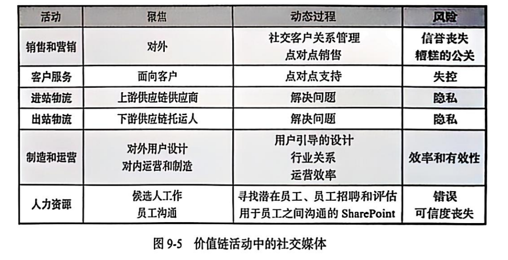
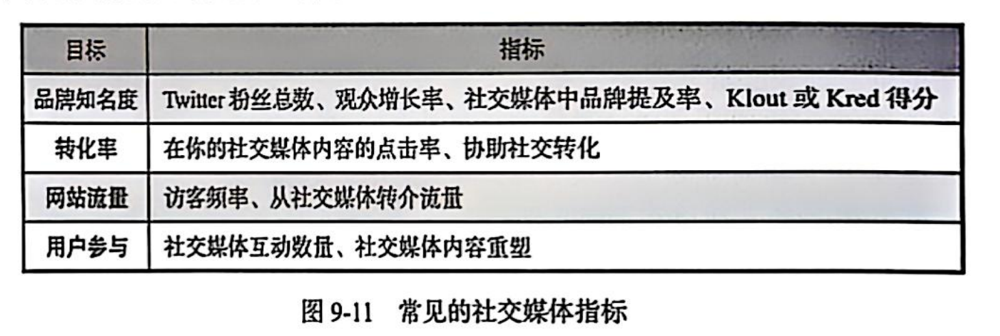

## 教材问题

**1. 社交媒体信息系统：**

支持在用户之间共享内容的信息系统。

三个角色：

- 社交媒体提供商
- 用户
- 社区

社交媒体提供商：

- 提供创建社交网络或在有共同兴趣的人之间创建社交关系的平台。

社交媒体信息系统的组成和信息系统五要素相同。

**2. SMIS 推进企业战略：**

战略决定价值链，价值链决定业务流程，业务流程决定信息系统。

- 众包：利用用户参与产品设计或产品再设计的动态社交媒体流程
- 社交客户关系管理是一个动态的、基于 SM 的客户关系管理流程，与传统的结构化和受控流程不同，客户和企业拥有同样多的控制权。

**3. SMIS 曾增加社会成本：**

- 资本
- 人力资本
- 社会资本
- 社会资本增加的四种方式
  - 信息
  - 影响
  - 社会凭证
  - 个人强化
- 决定社会资本的三个因素
  - 社会网络中关系的数量
  - 关系的强度
  - 这些关系控制的资源的价值
- 为什么他们比加法更有乘法性
  - 社会资本=关系数量\*关系强度\*实体资源
- 影响者
- 如何利用社交媒体增加社交关系的数量和强度

**4. 从社交媒体获得收入：**

- 货币化
- 社交媒体公司为什么很难获得收入
- 如何从广告和收费服务获得收入
  - 点击付费
  - 增加用户贡献来增加网站价值
- 点击付费
  - 广告商向潜在的客户免费展示广告，只有当客户点击才付费
- 转化率
- 免费增值
- 广告拦截
- 如何损害在线公司的产生收入的能力
- 移动设备的增长如何影响收入来源
- 为什么移动设备限制广告收入的担忧是过度反应
  - 绝对数量
  - 移动设备更高的点击率

**5. 企业如何开发有效的 SMIS：**

- 为什么 SMIS 的发展和企业的战略目标一致

  - 战略协同性

  企业战略明确了发展方向、业务重点与竞争策略，SMIS 作为企业运营工具，需围绕战略展开，比如企业战略聚焦市场拓展，SMIS 就可助力精准触达新客户、挖掘市场需求，协同推动战略落地。

  - 资源整合与优化

  企业资源（人力、财力、数据等 ）有限，SMIS 发展契合战略目标，能让资源投入到与战略关联的社交媒体运营中，避免资源分散，实现资源高效整合与优化利用，像围绕品牌建设战略，集中资源打造优质内容、维护核心社交平台。

  - 价值创造与竞争优势

  战略目标旨在为企业创造价值、构建竞争优势，SMIS 有效运用可通过社交媒体渠道强化品牌、提升客户关系、促进产品创新等，与战略协同创造价值，比如借助社交平台互动，依据用户反馈优化产品，巩固差异化竞争优势 。

  - 目标一致性保障

  企业战略分解为具体业务目标，SMIS 发展和战略一致，能使社交媒体运营的目标、指标（如粉丝增长、转化等 ）与业务目标呼应，保障企业整体目标体系连贯，推动从战略到执行的有效贯通，让各环节都为实现战略服务 。

- 有效的开发 SMIS 的过程

  - 明确目标
  - 确定成功的指标
  - 确定目标用户
  - 定义自己的价值
  - 确立人际关系
  - 收集分析数据

- 四种常见的社交媒体目标

- 为什么重要
- 指标
- 成功指标
- 虚荣指标
- 度量四个目标的指标的例子
- 用户建立个人联系 的重要性

**6. 企业社交网络：**

- 定义
  - 软件平台，利用社交媒体促进企业内人员的协同工作
- 主要目标
- Web 2.0 vs 企业 2.0
- 每个元素
- 渠道的变化影响企业和员工沟通方式
- ESN 如何使得每个企业受益

**7. 企业解决 SMIS 安全问题：**

- 两个社交媒体风险的来源
  - **非员工用户生成内容的风险**：如用户产生的不恰当内容（含攻击性、歧视性言论等 ），会给企业带来负面影响，像微软聊天机器人 Tay 因用户训练出现不良言论被禁用。
  - **员工使用社交媒体的风险**：员工可能因不当操作（如泄露企业信息、发表不当言论等 ），给企业信息安全、企业责任、员工生产力等带来威胁 。
- 社交媒体策略的目的和英特尔的指导方针
  - **社交媒体策略目的**：管理员工沟通风险，通过制定和宣传社交媒体政策，明确员工在社交媒体使用中的权利和责任，平衡企业社交媒体参与和风险管控 。
  - **英特尔的指导方针**：包含透明、保护、使用常识，其 2018 年政策三大支柱为透明、保护、使用常识，相关指南可在英特尔官网查阅，含大量建议与智慧 。
- UGC 的问题的四个来源，三种可能回答和回答的利弊
  - 垃圾和疯狂的言论；
  - 不恰当的内容；
  - 不利的评论；
  - 叛乱运动 。
  - **保留**：若问题内容是合法用户内容（如产品评论 ），可作为免费反馈源用于产品开发；但恶意内容保留会持续产生不良影响。
  - **删除**：可快速消除不当内容（如含淫秽、违法内容 ），但删除合法负面评价可能引发用户强烈反感。
  - **回应**：合理回应（如对产品批评真诚沟通改进 ）可解决问题、改善企业形象；但回应不当（如傲慢、敷衍 ）会激怒社区，产生更坏影响，还可能因回应内容成为负面公关素材 。
- 内部使用社交媒体对信息安全等等造成的风险
  - **信息安全威胁**：员工在社交媒体发布的内容（如工作经历、个人信息等 ）可能被攻击者利用，破解企业密码重置问题、获取企业资源访问权限，威胁企业信息安全 。
  - **企业责任增加**：员工用社交媒体时，若内容涉及企业业务（如泄露用户数据等 ），企业可能因未妥善管控面临合规责任，像医疗、金融企业需遵循特定指导方针保护用户数据，否则易违法违规 。
  - **员工生产力降低**：员工过度沉迷社交媒体（如上班时间刷社交平台 ），会分散工作精力，导致工作效率下降，影响企业整体生产力 ，还可能引发士气问题、诉讼风险等

## 名词解释

1. **广告拦截软件（Ad - blocking software）**：可屏蔽网页、应用中广告内容的软件，提升用户浏览体验，减少广告干扰 。 
2. **最佳实践（Best practice）**：在某领域被广泛认可、经实践验证有效的操作方法、流程或模式，供借鉴复用 。 
3. **跳出率（Bounce rate）**：网站分析指标，指用户仅访问一个页面就离开的比例，反映页面吸引力、内容相关性 。 
4. **企业对企业（Business - to - business，B2B ）**：企业间的商业活动模式，如供应商与采购商、服务商与企业客户间的交易、合作 。 
5. **企业对消费者（Business - to - consumer，B2C ）**：企业直接面向终端消费者的商业模式，如电商平台销售商品给个人用户 。 
6. **资本（Capital）**：用于生产、经营的资源，包括金融资本（资金 ）、实物资本（设备 ）、人力资本（人才 ）等，是企业运营基础 。 
7. **通信渠道（Communication channel）**：传递信息的途径，如邮件、短信、社交媒体平台、电话，用于企业与客户、员工沟通 。 
8. **社区（Community）**：因共同兴趣、目标聚集的人群集合，可在线上（如社交平台群组 ）或线下形成，促进交流、共享 。 
9. **实践社区（Community of practice）**：围绕特定专业实践，成员交流知识、经验、技能的社区，助力专业发展、问题解决 。 
10. **竞争分析（Competitive analysis）**：研究竞争对手的产品、策略、市场表现等，识别自身优势、劣势，制定竞争策略 。 
11. **连接数据（Connection data）**：记录实体间关联关系的数据，如社交网络中用户的好友关系、企业客户的合作联系 。 
12. **内容数据（Content data）**：承载信息、知识的内容相关数据，如文章文本、图片、视频、产品描述等 。 
13. **转化率（Conversion rate）**：营销指标，指目标行为（如购买、注册 ）完成数与总访问数的比例，衡量营销效果 。 
14. **众包（Crowdsourcing）**：企业将任务、问题外包给大众网络（如通过平台征集创意、解决难题 ），利用群体智慧、资源 。 
15. **企业 2.0（Enterprise 2.0 ）**：利用社交、协作技术（如企业社交网络 ），实现员工互动、知识共享、创新的企业运营模式 。 
16. **企业社交网络（Enterprise Social Network，ESN ）**：企业内部的社交平台，支持员工沟通、协作、知识分享，提升团队效率 。 
17. **分众分类法（Folksonomy）**：用户自主对内容进行标签分类的方法，形成灵活、自组织的分类体系，常见于社交、共享平台 。 
18. **免费增值（Freemium）**：商业模式，基础功能免费，高级功能、增值服务收费，吸引用户并实现盈利 。 
19. **地理围栏（Geofencing）**：基于地理位置划定虚拟边界，当设备进入/离开时触发特定动作（如推送广告、通知 ），用于精准营销、管理 。 
20. **人力资本（Human capital）**：企业员工具备的知识、技能、经验等，是企业创造价值的核心资源，可通过培训、招聘提升 。 
21. **影响者（Influencer）**：在特定领域有影响力、能引导他人观点和行为的个体，常用于社交营销、品牌推广 。 
22. **关键绩效指标（Key Performance Indicators，KPI ）**：衡量企业、部门、员工绩效的关键指标，如销售额、用户活跃度，用于目标管理、考核 。 
23. **指标（Metric）**：量化评估业务、流程、活动的数据标准，如点击率、成本率，辅助决策、监控进展 。 
24. **盈利（Monetize）**：将资产、活动转化为经济收益的过程，如企业通过广告、付费服务、产品销售实现盈利 。 
25. **点击付费（Pay per click）**：广告计费模式，广告主按用户点击广告的次数付费，常见于搜索引擎、社交媒体广告 。 
26. **SLATES 模型（SLATES ）**：社交协作工具的参考模型，包含搜索（Search ）、链接（Link ）、作者身份（Author ）、标签（Tag ）、扩展（Extend ），促进信息共享、协作 。 
27. **社会资本（Social capital）**：个体或组织通过社会网络、关系获得的资源、支持，体现为信任、合作、网络连接等价值 。 
28. **社交客户管理系统（Social CRM ）**：融合社交数据、功能的客户关系管理系统，分析社交互动，优化客户服务、营销 。 
29. **社交媒体（Social Media，SM ）**：供用户创建、分享、交互内容的在线平台，如微信、微博、Facebook，促进人际沟通、信息传播 。 
30. **社交媒体信息系统（Social Media Information System，SMIS ）**：支持社交媒体运营、管理、分析的系统，涵盖内容发布、用户互动监测、数据挖掘等功能 。 
31. **社交媒体政策（Social media policy）**：企业规范员工社交媒体行为的准则，明确信息发布、品牌维护、合规等要求 。 
32. **社交媒体提供商（Social media provider）**：提供社交媒体平台及相关服务的企业或组织，如腾讯（微信 ）、字节跳动（抖音 ） 。 
33. **社交网络（Social network）**：由个体、组织及其关系构成的网络结构，线上社交平台（如 LinkedIn ）是典型形式，助力人脉拓展、信息流通 。 
34. **关系强度（Strength of a relationship）**：衡量社交关系紧密程度的指标，受互动频率、情感连接、信任度等影响 。 
35. **成功指标（Success metric）**：判定活动、项目是否成功的量化标准，如产品上线后的用户增长率、收入目标达成率 。 
36. **使用增加价值（Use increases value）**：网络效应的体现，用户越多、使用越频繁，平台、产品价值越大（如社交软件 ） 。 
37. **用户生成内容（User - generated Content，UGC ）**：由用户创作、分享的内容，如社交平台的帖子、评论、短视频，丰富平台生态 。 
38. **用户（User）**：使用产品、服务、平台的个体，是企业关注的对象，其行为、需求影响产品设计、运营 。 
39. **社会资本价值（Value of social capital）**：社会资本为个体、组织带来的经济效益、社会资源、竞争优势等价值体现 。 
40. **虚荣指标（Vanity metric）**：看似好看但缺乏实际业务价值的指标，如点赞数、浏览量，未转化为核心收益、用户留存等 。 
41. **病毒式吸引（Viral hook）**：让内容、产品像病毒一样快速传播的设计元素、机制，如有趣挑战、福利激励，引发用户自发分享 。 
42. **网络 2.0（Web 2.0 ）**：强调用户交互、参与的互联网模式，支持用户创建、共享内容（如博客、社交平台 ），区别于单向传播的 Web 1.0 。